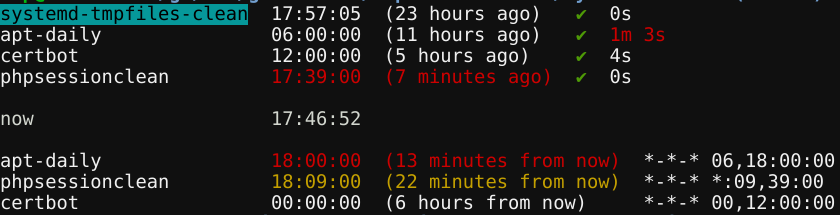

# systemd-timers

[](https://travis-ci.org/baptistemarchand/systemd-timers)

Better `systemctl list-timers`



## VS. `systemctl list-timers`

systemd has `systemctl list-timers` but it's hard to read and we cannot check task execution result or the time it took to run:

```bash
$ sudo systemctl list-timers
NEXT                         LEFT         LAST                         PASSED       UNIT                           ACTIVATES
Fri 2017-02-03 13:54:00 JST  12s left     Fri 2017-02-03 13:53:02 JST  44s ago      failed.timer                   failed.service
Fri 2017-02-03 19:03:00 JST  5h 9min left Fri 2017-02-03 05:03:18 JST  8h ago       docker-cleanup.timer           docker-cleanup.service
Fri 2017-02-03 21:51:07 JST  7h left      Thu 2017-02-02 21:51:07 JST  16h ago      systemd-tmpfiles-clean.timer   systemd-tmpfiles-clean.service
```

My version uses a different way of displaying timers. The previous execution and next execution are split in two different lines.
First you see the timers executions that are in the past (above the `now` line) and below you see the future executions.
The color of the time depends on how long it is from now. Red is less than 15 minutes. Yellow is less than 30 minutes.


You can add the `-v` flag to see the timer's schedule.

You add arguments to filter the timers. For example `./systemd-timers apt` will only show the timers containing the string `apt`.
